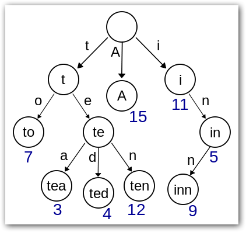
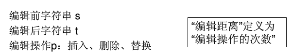
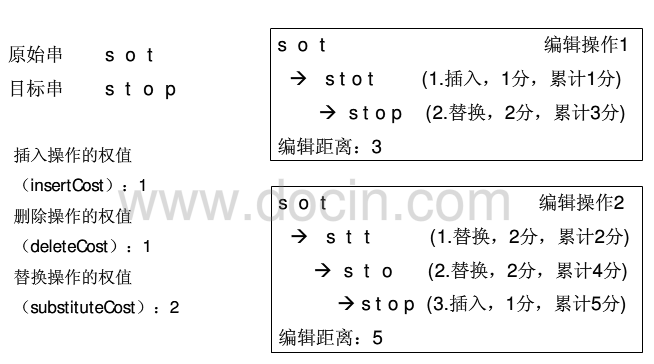
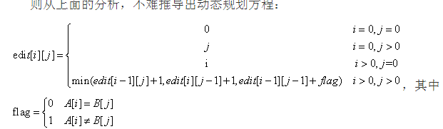
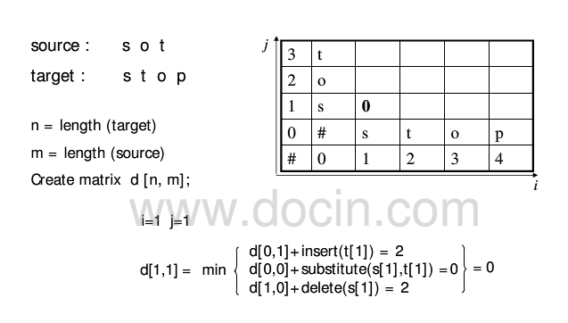
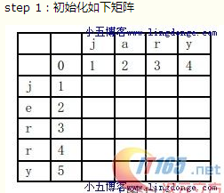
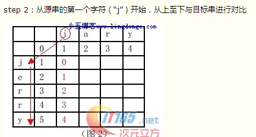
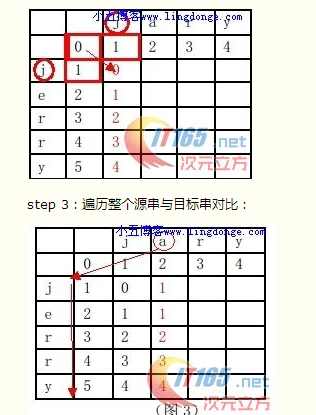
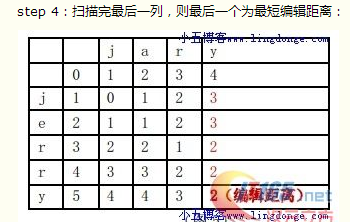

Trietree
========

**Trie**，又称单词查找树;是一种**树形**结构;用于保存大量的字符串。

**优点**：利用字符串的**公共前缀**来节约存储空间。

**典型应用**：是用于统计和排序大量的[字符串](http://zh.wikipedia.org/wiki/%E5%AD%97%E7%AC%A6%E4%B8%B2)（但不仅限于字符串），所以经常被搜索引擎系统用于文本词频统计。

Trie的**核心思想**是空间换时间：利用字符串的公共前缀来降低查询时间的开销以达到提高效率的目的。

**3个基本性质**：

1.  [*根节点*](http://zh.wikipedia.org/w/index.php?title=%E6%A0%B9%E8%8A%82%E7%82%B9&action=edit&redlink=1)不包含[*字符*](http://zh.wikipedia.org/wiki/%E5%AD%97%E7%AC%A6)，除根节点外每一个节点都只包含一个[*字符*](http://zh.wikipedia.org/wiki/%E5%AD%97%E7%AC%A6)。

2.  从[*根节点*](http://zh.wikipedia.org/w/index.php?title=%E6%A0%B9%E8%8A%82%E7%82%B9&action=edit&redlink=1)到某一[*节点*](http://zh.wikipedia.org/wiki/%E8%8A%82%E7%82%B9)，[*路径*](http://zh.wikipedia.org/wiki/%E8%B7%AF%E5%BE%84)上经过的[*字符*](http://zh.wikipedia.org/wiki/%E5%AD%97%E7%AC%A6)连接起来，为该[*节点*](http://zh.wikipedia.org/wiki/%E8%8A%82%E7%82%B9)对应的[*字符串*](http://zh.wikipedia.org/wiki/%E5%AD%97%E7%AC%A6%E4%B8%B2)。

3.  每个[*节点*](http://zh.wikipedia.org/wiki/%E8%8A%82%E7%82%B9)的所有[*子节点*](http://zh.wikipedia.org/w/index.php?title=%E5%AD%90%E8%8A%82%E7%82%B9&action=edit&redlink=1)包含的[*字符*](http://zh.wikipedia.org/wiki/%E5%AD%97%E7%AC%A6)都不相同。

{width="4.395833333333333in" height="4.135416666666667in"}

该Trie树用11个节点保存了8个字符串tea，ted，ten，to，A，i，in，inn.

**Python dict**

字典是另一种**可变容器模型**，且**可存储任意类型**对象。

字典的每个键值(key=&gt;value)对用冒号(**:**)分割，每个对之间用逗号(**,**)分割，整个字典包括在花括号(**{})**中 ；

字典值可以没有限制地取任何[***Python***](http://lib.csdn.net/base/python)对象，既可以是标准的对象，也可以是用户定义的；但键不行，如果同一个键被赋值两次，后一个值会被记住。

值可以取任何数据类型，但键必须是不可变的，如字符串，数字或元组（列表这样的可变类型不能作为键）。

**代码：**

class TrieNode:

{

**def \_\_init\_\_(self)**:

self.word = None

self.freq = None

self.children = {}

global NodeCount \#节点个数，如上图11个节点数

NodeCount += 1

**def insert( self, word, freq)**:

node = self

for letter in word:

if letter not in node.children:

node.children\[letter\] = TrieNode()

node = node.children\[letter\]

node.word = word

node.freq = freq

\#**递归搜索树的每个分支**

**def search( word, maxCost, trie): \#maxCost编辑距离**

\# build first row

currentRow = range( len(word) + 1 )

results = \[\]

for letter in trie.children:

searchRecursive( trie.children\[letter\], letter, word, currentRow, results, maxCost )

return results

**def searchRecursive( node, letter, word, previousRow, results, maxCost ):**

columns = len( word ) + 1

currentRow = \[ previousRow\[0\] + 1 \]

\#**为字母构建一行，目标单词中的每个字母都占一列，另外一列为0列的空字符串** for column in xrange( 1, columns ):

insertCost = currentRow\[column - 1\] + 1 **\#插入操作的权重**

deleteCost = previousRow\[column\] + 1 **\#删除操作的权重**

if word\[column - 1\] != letter:

replaceCost = previousRow\[ column - 1 \] + 1 **\#替换操作的权重**

else:

replaceCost = previousRow\[ column - 1 \]

currentRow.append( min( insertCost, deleteCost, replaceCost ) )

\# if the last entry in the row indicates the optimal cost is less than the

\# maximum cost, and there is a word in this trie node, then add it.

if currentRow\[-1\] &lt;= maxCost and node.word != None:

results.append( (node.word, currentRow\[-1\], node.freq ) )

\# if any entries in the row are less than the maximum cost, then

\# recursively search each branch of the trie

if min( currentRow ) &lt;= maxCost:

for letter in node.children:

searchRecursive( node.children\[letter\], letter, word, currentRow,

results, maxCost )

}

最小编辑距离
============

编辑距离
--------

{width="5.768055555555556in" height="1.074912510936133in"}{width="5.768055555555556in" height="3.209722222222222in"}

算法基本原理：
--------------

假设我们可以使用d\[ i , j \]个步骤（可以使用一个二维数组保存这个值），表示将串s\[ 1…i \] 转换为 串t \[ 1…j \]所需要的最少步骤个数，那么，在最基本的情况下，即在i等于0时，也就是说串s为空，那么对应的d\[0,j\] 就是 增加j个字符，使得s转化为t，在j等于0时，也就是说串t为空，那么对应的d\[i,0\] 就是 减少 i个字符，使得s转化为t。

  然后我们考虑一般情况，加一点动态规划的想法，我们要想得到将s\[1..i\]经过最少次数的增加，删除，或者替换操作就转变为t\[1..j\]，那么我们就必须在之前可以以最少次数的增加，删除，或者替换操作，使得现在串s和串t只需要再做一次操作或者不做就可以完成s\[1..i\]到t\[1..j\]的转换。所谓的“之前”分为下面三种情况：

1）我们可以在k个操作内将 s\[1…i\] 转换为 t\[1…j-1\]

2）我们可以在k个操作里面将s\[1..i-1\]转换为t\[1..j\]

3）我们可以在k个步骤里面将 s\[1…i-1\] 转换为 t \[1…j-1\]

针对第1种情况，我们只需要在最后将 t\[j\] **加上**s\[1..i\]就完成了匹配，这样总共就需要k+1个操作。

针对第2种情况，我们只需要在最后将s\[i\]**移除**，然后再做这k个操作，所以总共需要k+1个操作。

针对第3种情况，我们只需要在最后将s\[i\]**替换**为 t\[j\]，使得满足s\[1..i\] == t\[1..j\]，这样总共也需要k+1个操作。而如果在第3种情况下，s\[i\]刚好等于t\[j\]，那我们就可以仅仅使用k个操作就完成这个过程。

  最后，为了保证得到的操作次数总是最少的，我们可以从上面三种情况中选择消耗最少的一种最为将s\[1..i\]转换为t\[1..j\]所需要的最小操作次数。

[*http://www.cnblogs.com/sumuncle/p/5632032.html*](http://www.cnblogs.com/sumuncle/p/5632032.html)

*计算公式：*
------------

{width="5.768055555555556in" height="1.681188757655293in"}

{width="5.768055555555556in" height="3.277922134733158in"}

图解过程如下：
--------------

{width="2.625in" height="2.2604166666666665in"} {width="4.489583333333333in" height="2.40625in"}

如果两个字符**相等**，则在从此位置的**左，上，左上**三个位置中取出最小的值；若**不等**，则在从此位置的**左，上，左上三个位置**中取出最小的值再**加上1**；

{width="3.2916666666666665in" height="4.322916666666667in"} {width="3.6458333333333335in" height="2.3125in"}
